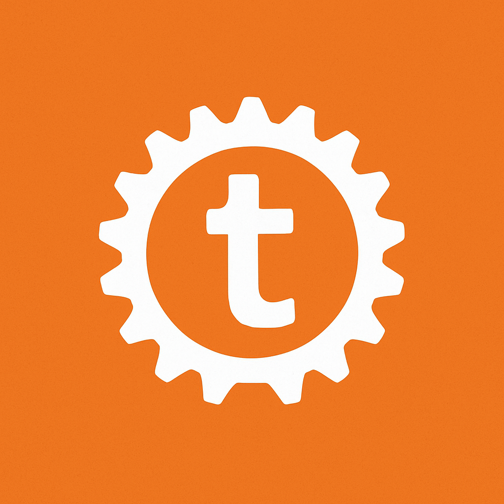

<p align="center">
  
</p>

<h1 align="center">duck-template</h1>

<p align="center">
  Fast, JSON-driven Rust scaffolder for projects, files, and variants.
</p>

<p align="center">
  <a href="./LICENSE">MIT</a> -
  <a href="https://crates.io/crates/duck-template">crates.io</a> -
  <a href="https://docs.rs/duck-template">docs.rs</a> -
  <a href="https://github.com/gentleeduck/duck-template/issues">issues</a>
</p>

<p align="center">
  <a href="https://crates.io/crates/duck-template"></a>
  <a href="https://docs.rs/duck-template"></a>
  <a href="./LICENSE"></a>
</p>

---

## Install

```sh
cargo install duck-template
```

## Quick start

```sh
duck-template init
duck-template create my-app --variant cli
duck-template create-variant web
```

The generator reads a template descriptor (local file or remote URL)
and emits the project tree from JSON. Flags are injected dynamically
into template placeholders.

## Features

| feature | what |
| --- | --- |
| JSON templates | declarative project + file scaffold |
| Variants | per-template layouts (`cli`, `api`, `web`, ...) |
| Local or remote configs | path or URL |
| Dynamic flag injection | flags become template vars |
| Modular commands | `init`, `create`, `create-variant` |

## Commands

```sh
duck-template init                      # interactive setup
duck-template create <name> [--variant] # generate from current template
duck-template create-variant <name>     # add a variant under the template
```

## Schema

A template is a JSON file with this shape:

```json
{
  "name": "my-template",
  "variants": {
    "cli":  { "files": [ ... ] },
    "web":  { "files": [ ... ] }
  },
  "flags": { "name": "string", "rust_version": "string" }
}
```

See [`public/schema.json`](public/schema.json) for the full schema.

## Build from source

```sh
git clone https://github.com/gentleeduck/duck-template
cd duck-template
cargo build --release
./target/release/duck-template --help
```

## Contributing

PR checklist + style notes in [`CONTRIBUTING.md`](CONTRIBUTING.md).
Security issues: [`SECURITY.md`](SECURITY.md).
Behaviour: [`CODE_OF_CONDUCT.md`](CODE_OF_CONDUCT.md).

## License

MIT. See [`LICENSE`](LICENSE).
